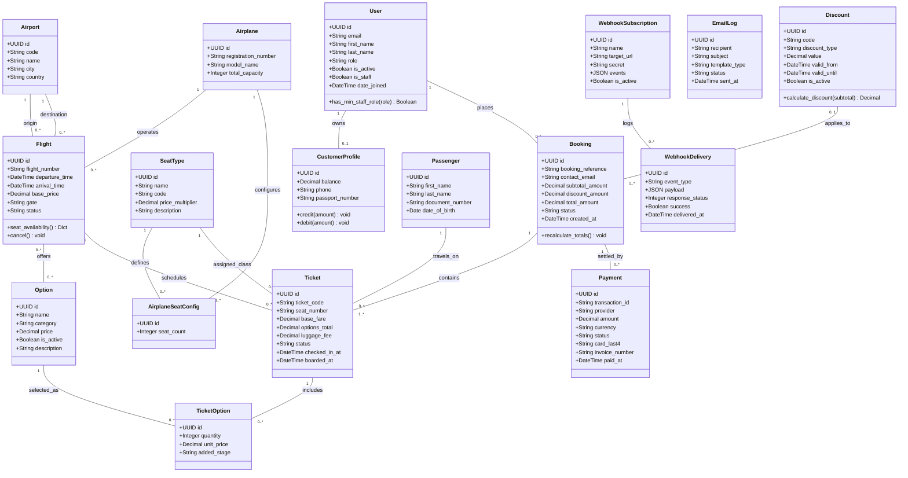
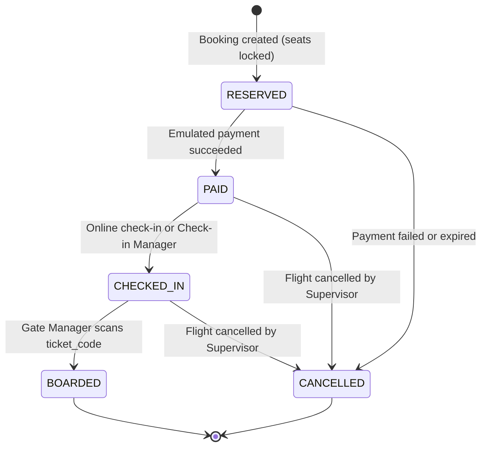
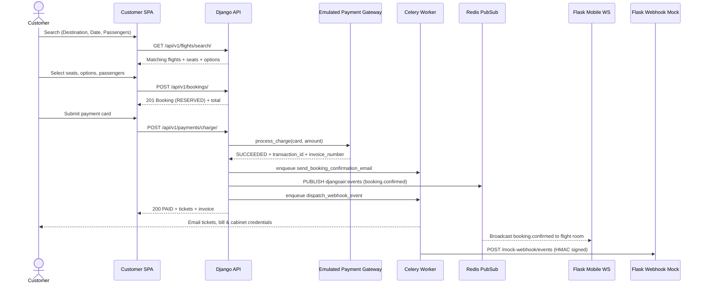

# DjangoAir ERP System — UML Diagrams

## 1. UML Class Diagram

```mermaid
classDiagram
    direction TB

    class User {
        +UUID id
        +String email
        +String first_name
        +String last_name
        +String role
        +Boolean is_active
        +Boolean is_staff
        +DateTime date_joined
        +has_min_staff_role(role) Boolean
    }

    class CustomerProfile {
        +UUID id
        +Decimal balance
        +String phone
        +String passport_number
        +credit(amount) void
        +debit(amount) void
    }

    class Airport {
        +UUID id
        +String code
        +String name
        +String city
        +String country
    }

    class Airplane {
        +UUID id
        +String registration_number
        +String model_name
        +Integer total_capacity
    }

    class SeatType {
        +UUID id
        +String name
        +String code
        +Decimal price_multiplier
        +String description
    }

    class AirplaneSeatConfig {
        +UUID id
        +Integer seat_count
    }

    class Flight {
        +UUID id
        +String flight_number
        +DateTime departure_time
        +DateTime arrival_time
        +Decimal base_price
        +String gate
        +String status
        +seat_availability() Dict
        +cancel() void
    }

    class Option {
        +UUID id
        +String name
        +String category
        +Decimal price
        +Boolean is_active
        +String description
    }

    class Discount {
        +UUID id
        +String code
        +String discount_type
        +Decimal value
        +DateTime valid_from
        +DateTime valid_until
        +Boolean is_active
        +calculate_discount(subtotal) Decimal
    }

    class Booking {
        +UUID id
        +String booking_reference
        +String contact_email
        +Decimal subtotal_amount
        +Decimal discount_amount
        +Decimal total_amount
        +String status
        +DateTime created_at
        +recalculate_totals() void
    }

    class Passenger {
        +UUID id
        +String first_name
        +String last_name
        +String document_number
        +Date date_of_birth
    }

    class Ticket {
        +UUID id
        +String ticket_code
        +String seat_number
        +Decimal base_fare
        +Decimal options_total
        +Decimal luggage_fee
        +String status
        +DateTime checked_in_at
        +DateTime boarded_at
    }

    class TicketOption {
        +UUID id
        +Integer quantity
        +Decimal unit_price
        +String added_stage
    }

    class Payment {
        +UUID id
        +String transaction_id
        +String provider
        +Decimal amount
        +String currency
        +String status
        +String card_last4
        +String invoice_number
        +DateTime paid_at
    }

    class EmailLog {
        +UUID id
        +String recipient
        +String subject
        +String template_type
        +String status
        +DateTime sent_at
    }

    class WebhookSubscription {
        +UUID id
        +String name
        +String target_url
        +String secret
        +JSON events
        +Boolean is_active
    }

    class WebhookDelivery {
        +UUID id
        +String event_type
        +JSON payload
        +Integer response_status
        +Boolean success
        +DateTime delivered_at
    }

    User "1" -- "0..1" CustomerProfile : owns
    Airport "1" -- "0..*" Flight : origin
    Airport "1" -- "0..*" Flight : destination
    Airplane "1" -- "0..*" Flight : operates
    Airplane "1" -- "1..*" AirplaneSeatConfig : configures
    SeatType "1" -- "0..*" AirplaneSeatConfig : defines
    Flight "0..*" -- "0..*" Option : offers

    User "1" -- "0..*" Booking : places
    Discount "0..1" -- "0..*" Booking : applies_to
    Booking "1" -- "1..*" Ticket : contains
    Booking "1" -- "0..*" Payment : settled_by

    Flight "1" -- "0..*" Ticket : schedules
    Passenger "1" -- "0..*" Ticket : travels_on
    SeatType "1" -- "0..*" Ticket : assigned_class
    Ticket "1" -- "0..*" TicketOption : includes
    Option "1" -- "0..*" TicketOption : selected_as

    WebhookSubscription "1" -- "0..*" WebhookDelivery : logs
```

## 2. Ticket Lifecycle State Diagram

```mermaid
stateDiagram-v2
    [*] --> RESERVED: Booking created (seats locked)
    RESERVED --> PAID: Emulated payment succeeded
    RESERVED --> CANCELLED: Payment failed or expired
    PAID --> CHECKED_IN: Online check-in or Check-in Manager
    CHECKED_IN --> BOARDED: Gate Manager scans ticket_code
    PAID --> CANCELLED: Flight cancelled by Supervisor
    CHECKED_IN --> CANCELLED: Flight cancelled by Supervisor
    BOARDED --> [*]
    CANCELLED --> [*]
```

## 3. Booking, Payment & Async Event Sequence Diagram

```mermaid
sequenceDiagram
    actor Customer
    participant CustomerSPA as Customer SPA
    participant Django as Django API
    participant Gateway as Emulated Payment Gateway
    participant Celery as Celery Worker
    participant Redis as Redis PubSub
    participant FlaskWS as Flask Mobile WS
    participant WebhookMock as Flask Webhook Mock

    Customer->>CustomerSPA: Search (Destination, Date, Passengers)
    CustomerSPA->>Django: GET /api/v1/flights/search/
    Django-->>CustomerSPA: Matching flights + seats + options

    Customer->>CustomerSPA: Select seats, options, passengers
    CustomerSPA->>Django: POST /api/v1/bookings/
    Django-->>CustomerSPA: 201 Booking (RESERVED) + total

    Customer->>CustomerSPA: Submit payment card
    CustomerSPA->>Django: POST /api/v1/payments/charge/
    Django->>Gateway: process_charge(card, amount)
    Gateway-->>Django: SUCCEEDED + transaction_id + invoice_number
    Django->>Celery: enqueue send_booking_confirmation_email
    Django->>Redis: PUBLISH djangoair:events (booking.confirmed)
    Django->>Celery: enqueue dispatch_webhook_event
    Django-->>CustomerSPA: 200 PAID + tickets + invoice

    Celery-->>Customer: Email tickets, bill & cabinet credentials
    Redis-->>FlaskWS: Broadcast booking.confirmed to flight room
    Celery->>WebhookMock: POST /mock-webhook/events (HMAC signed)
```
